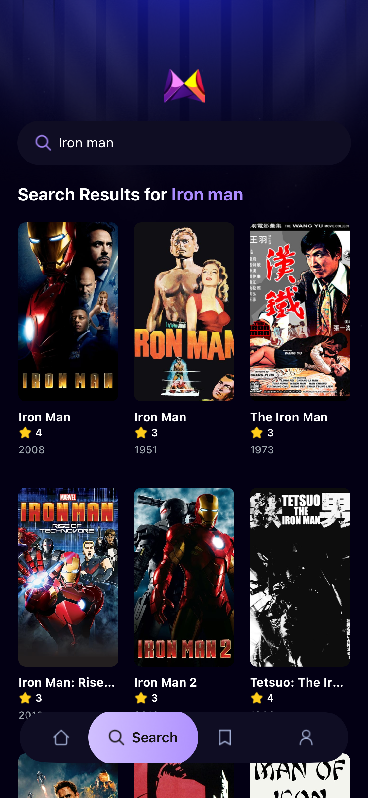

# Welcome to your Expo app 👋

This is an [Expo](https://expo.dev) project created with [`create-expo-app`](https://www.npmjs.com/package/create-expo-app).

## Get started

1. Install dependencies

   ```bash
   npm install
   ```

2. Start the app

   ```bash
   npx expo start
   ```

In the output, you'll find options to open the app in a

- [development build](https://docs.expo.dev/develop/development-builds/introduction/)
- [Android emulator](https://docs.expo.dev/workflow/android-studio-emulator/)
- [iOS simulator](https://docs.expo.dev/workflow/ios-simulator/)
- [Expo Go](https://expo.dev/go), a limited sandbox for trying out app development with Expo

You can start developing by editing the files inside the **app** directory. This project uses [file-based routing](https://docs.expo.dev/router/introduction).

## Get a fresh project

When you're ready, run:

```bash
npm run reset-project
```

This command will move the starter code to the **app-example** directory and create a blank **app** directory where you can start developing.

## Learn more

To learn more about developing your project with Expo, look at the following resources:

- [Expo documentation](https://docs.expo.dev/): Learn fundamentals, or go into advanced topics with our [guides](https://docs.expo.dev/guides).
- [Learn Expo tutorial](https://docs.expo.dev/tutorial/introduction/): Follow a step-by-step tutorial where you'll create a project that runs on Android, iOS, and the web.

## Join the community

Join our community of developers creating universal apps.

- [Expo on GitHub](https://github.com/expo/expo): View our open source platform and contribute.
- [Discord community](https://chat.expo.dev): Chat with Expo users and ask questions.

## Screenshots

Below are the app screenshots used for the project UI reference. Add the actual PNG files to `assets/screenshots/` with the filenames shown below so they render here on GitHub and in the project.

Home (top of app)


Trending / Featured



Latest Movies


How to add your screenshots

1. Create the folder `assets/screenshots/` in the project root (if it doesn't already exist).
2. Copy your three PNG images into that folder with these filenames:
    - `home.png` — Home screen with search & trending
    - `trending.png` — Trending movies row
    - `latest.png` — Latest movies row

Example (macOS / zsh):

```bash
# from the project root
mkdir -p assets/screenshots
cp \\
   "/Users/yourname/Library/Group Containers/group.com.apple.coreservices.useractivityd/shared-pasteboard/items/0A449F4E-5AAE-46BE-A601-D90AE6C14466/IMG_6955.png" \
   assets/screenshots/home.png
cp \\
   "/Users/yourname/Library/Group Containers/group.com.apple.coreservices.useractivityd/shared-pasteboard/items/C2C5A988-DEA9-4E1C-933C-04C5E6B6555C/IMG_6956.png" \
   assets/screenshots/trending.png
cp \\
   "/Users/yourname/Library/Group Containers/group.com.apple.coreservices.useractivityd/shared-pasteboard/items/8EAFB437-BEDD-402A-AC7F-1DE4CD98B367/IMG_6957.png" \
   assets/screenshots/latest.png
```

If you want me to add the actual PNG files to the repository, upload the images here or give me the local paths and confirm I should copy them into `assets/screenshots/`.
